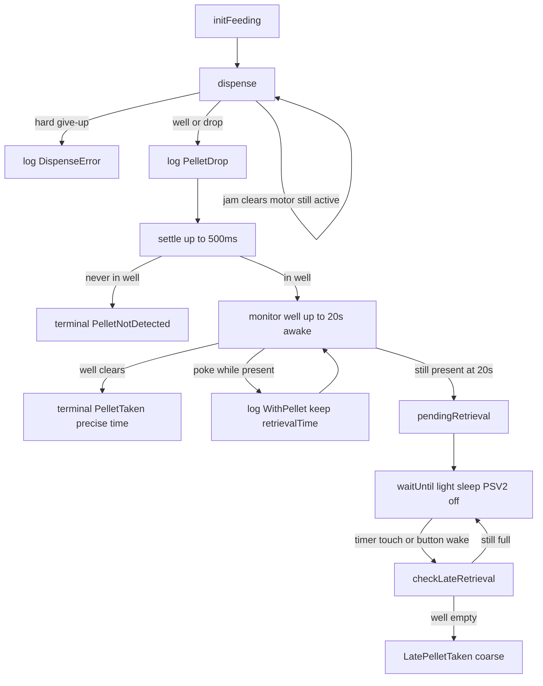

# FED4 Feed Pipeline

How pellet delivery, awake retrieval timing, and **late retrieval** (after the 20 s window) work. Motor/jam hardware details: [Motor-and-Pellet-Dispensing.md](Motor-and-Pellet-Dispensing.md).

## Roles

| API | Owns |
|-----|------|
| **`feed()`** | Dispense (jam *clears* while motor still trying; **`DispenseError` only on hard give-up**), settle, well monitor **≤20 s** for **precise** `retrievalTime`, then `PelletTaken` **or** set **`pendingRetrieval`** if pellet still in well |
| **`waitUntil()` / sleep** | **PSV2/PSV3 off** in light sleep (battery). On wake, `checkLateRetrieval()` logs **`LatePelletTaken`** if the well is empty — coarse time, up to the UI interval (default 60 s) |

A pellet does **not** appear without the motor. Late handling is only for a pellet **already in the well** after the awake window. Photogate GPIO wake is **not** used (would require PSV2 on for the IR LED). Sketches do **not** need to call `checkLateRetrieval()` themselves.

**BasicFED4** (poke → feed):

```cpp
FedEvent e = fed4.waitUntil();
if (e.source == FedWakeSource::Touch && e.pad == FedPad::Left) {
  fed4.feed();
  fed4.update();
}
```

**FreeFeeding** (replace when taken — do not re-dispense while well occupied):

```cpp
while (fed4.checkForPellet()) {
  fed4.waitUntil(); // timer/touch wake; LatePelletTaken when pending + well empty
}
fed4.feed();
fed4.update();
```

## Why 20 s awake, then coarse late logging?

- **≤20 s in `feed()`:** stay awake and poll so `PelletTaken` retrieval times are accurate.
- **After 20 s still present:** light sleep with **PSV2 off** (~photogate mA saved). Next normal wake → power PSV2 → read well → **`LatePelletTaken`** if gone. Event name marks lost resolution vs in-window `PelletTaken`.

## Flowchart



## CSV events

| Event | When |
|-------|------|
| `PelletDrop` | Dispense succeeded (well and/or drop); count incremented |
| `LeftWithPellet` / `CenterWithPellet` / `RightWithPellet` | Poke while pellet in well (does not clear retrieval time) |
| `PelletTaken` | Well cleared **during** the awake ≤20 s window (precise `RetrievalTime`) |
| `LatePelletTaken` | Well cleared **after** that window (checked on `waitUntil` wake; coarse time) |
| `PelletNotDetected` | `PelletDrop` but well empty after settle — not a late-retrieval case |
| `DispenseError` | Hard jam give-up only (`jammed()`) — not during jam-clear moves |

ENV/battery on every row: last `update()` → `refreshSensors()` snapshot.

## Gaps identified → remedies

| Gap | Remedy |
|-----|--------|
| Photogate wake needs PSV2 (IR LED ~2.5–3 mA) | Drop photogate wake; **PSV2 off** in light sleep; accept coarse `LatePelletTaken` |
| Late take only visible on UI interval | Intentional trade for weeks of battery; event name flags resolution |
| Sketch had to call `checkLateRetrieval()` | Still library-owned inside `waitUntil` / `feed` entry |
| “Wait for pellet to appear” after settle miss | Removed — late = late **take** of pellet still in well |
| `DispenseError` during jam clears | Error only from `jammed()` |

## Notes

- Before `PSV2_OFF()`, photogate and I2S GPIOs are driven LOW to limit back-power into 3.3V2.
- `feed()` also calls `checkLateRetrieval()` at entry before a new dispense.
